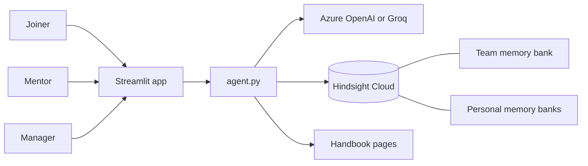

# Ramp: the onboarding agent that remembers

New joiners at large companies spend their first weeks asking questions that every earlier joiner already asked. The answers exist, but they are scattered across outdated wiki pages and the heads of senior engineers. Mentors answer the same thing again and again, and nobody notices which pages keep confusing people.

Ramp is an onboarding assistant with memory. It answers new joiners' questions, admits when a handbook page might be outdated, and asks a mentor instead of guessing. Once a mentor answers, the answer is stored in team memory, and every future joiner gets it instantly. Ramp also remembers each joiner's own journey, so it picks up where they left off.

**Every joiner makes onboarding faster for the next one.**

## How Hindsight memory is used

Ramp uses [Hindsight](https://github.com/vectorize-io/hindsight) as its memory layer ([docs](https://hindsight.vectorize.io/)). There are two kinds of memory bank:

| Bank | What it holds | Written when | Read when |
| --- | --- | --- | --- |
| `nimbus-team` (team memory) | Verified answers from mentors | A mentor answers a forwarded question | Every question from every joiner |
| `nimbus-joiner-<id>` (personal memory) | One joiner's questions, outcomes, and what they finished or got stuck on | Every question, mentor answer and "This worked / Still stuck" click | That joiner's questions and their welcome-back note |

The learning loop:

1. A joiner asks a question. Ramp **recalls** from team memory and the joiner's personal memory, and searches the handbook.
2. The model answers. If the only source is a handbook page older than a year and no mentor memory covers it, Ramp says it isn't sure and forwards the question to the joiner's mentor.
3. The mentor answers once. Ramp **retains** the answer in team memory, tagged with the topic and mentor.
4. The next joiner who asks gets the verified answer immediately, with the source shown.
5. The manager view uses Hindsight **reflect** to summarise what joiners struggle with and which pages to fix.

The "Memory on" switch shows the difference: with memory off, Ramp behaves like a plain handbook bot and confidently repeats outdated steps.

## Screens

- **Joiner:** chat, a welcome-back note built from memory, mentor answers as they arrive, and a progress panel.
- **Mentor:** questions waiting for an answer. Each answer is saved to team memory.
- **Manager:** where joiners get stuck, handbook pages to update, each joiner's progress, and a memory-based summary.

## Architecture



## Project structure

```
app.py            Streamlit screens for joiners, mentors and the manager
agent.py          Answering, confidence check, forwarding, mentor replies, progress, insights
memory.py         Hindsight retain / recall / reflect for team and personal memory
llm.py            Model wrapper for Azure OpenAI, Groq or OpenAI
store.py          People, handbook pages and live activity (JSON files)
config.py         Settings from .env
seed_memory.py    Loads past onboarding history into memory
check_setup.py    Checks that the model and Hindsight keys work
data/handbook/    Ten handbook pages, three of them deliberately outdated
data/people.json  Joiners, mentors and the manager
data/past_qa.json Earlier questions and mentor answers
docs/             Demo script and team guide
```

## Run it

Requires Python 3.10 or newer.

```bash
git clone <your-repo-url>
cd ramp-onboarding-agent
python -m venv .venv
source .venv/bin/activate          # Windows: .venv\Scripts\activate
pip install -r requirements.txt
cp .env.example .env               # Windows: copy .env.example .env
```

Edit `.env`:

- `HINDSIGHT_API_KEY`: from [Hindsight Cloud](https://ui.hindsight.vectorize.io)
- `LLM_PROVIDER=azure` with your Azure OpenAI endpoint, key and deployment, or `LLM_PROVIDER=groq` with a Groq key

Then:

```bash
python check_setup.py     # both lines should say they worked
python seed_memory.py     # loads past history into Hindsight (about a minute)
streamlit run app.py
```

With no keys at all, the app still runs using a mock model and local memory, which is enough for building the screens.

To reset for a new demo run, click **Demo controls > Clear live activity** in the sidebar. To reset Hindsight memory too, change `BANK_PREFIX` in `.env` (for example `nimbus2`) and run `python seed_memory.py` again.

## Data

All people, handbook pages and history are synthetic, for demonstration. The VPN, timesheet and staging database pages are deliberately outdated so the difference between a handbook bot and a memory-backed agent is visible.

## Limitations

- The first few joiners on a new topic still need mentors; memory only helps once someone has answered.
- A mentor's answer can itself go out of date. Mentors should answer again, and the newer memory wins.
- A real deployment needs company sign-in and permissions, and would read the real wiki instead of sample pages.

## Next steps

- Run inside Microsoft Teams so joiners don't need a separate app.
- Read pages directly from SharePoint or Confluence.
- Notify page owners automatically when joiners keep getting stuck on their page.
